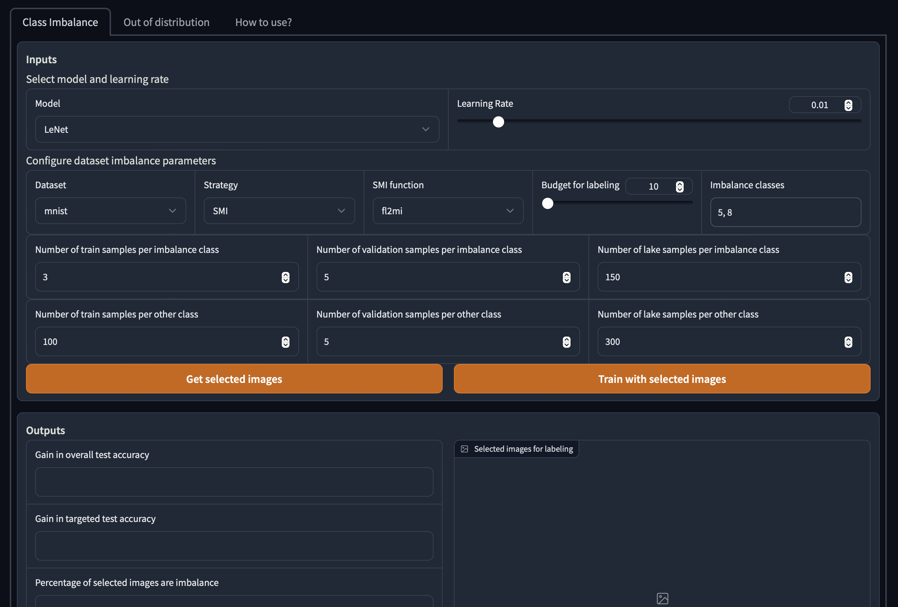

## Virtual Environment

```
python3 -m venv venv
source venv/bin/activate
pip install --upgrade pip
```

## Requirements

```
pip install -r requirements.txt
pip install -i https://test.pypi.org/simple/ --extra-index-url https://pypi.org/simple/ submodlib
```

## Run

Open constants.py and change the path of demo video(demo_video_path) to your local repository.

Finally run the app using the following command:

```
python3 app.py
```

## How to use (Video)


The app will open up in port 9000, open it in your browser.
You can find a "How to use?" button in the app, which will guide you through the process. (Demo of demo :P)


